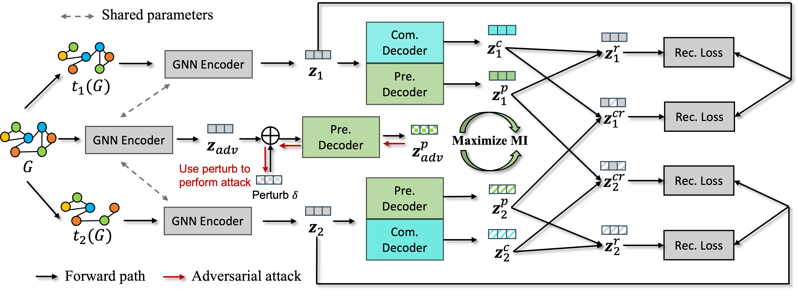

## GCVR: Reconstruction from Cross-View Enable Sufficient and Robust Graph Contrastive Learning



This is the official implementaiton of the paper **GCVR: Reconstruction from Cross-View Enable Sufficient and Robust Graph Contrastive Learning** published in UAI 2024. Our paper can be found at [Openreivew Link](https://openreview.net/pdf?id=DA1zd1Qdon). 

### Requirment and Depedency 

The packages we use include,

```
- python >= 3.8.5
- Pytorch >= 1.10.1
- PyTorch Geometric == 2.0.4;
- PyGCL == 0.1.2
- Numpy >= 1.20.1
- scikit-learn >= 0.24.1
```

### Instruction 

We conduct experiments on multiple benchmark datasets, 

- To run the code on TU dataset (e.g., MUTAG),

```shell
python src/models/GCVR/trainGCVR.py -d MUTAG
```

- To run the code on ogbg-molhiv dataset,

```shell
python src/models/GCVRogb/trainGCVRogb.py
```

- To run the code on GPU device, please specify the gpu id (e.g., 0) in the running command,

```shell
python src/models/GCVR/trainGCVR.py -d MUTAG -g 0
```

Most of our experiments are conducted on Nvidia RTX 3090 GPU, so all the datasets should be able to run on 24 GB GPUs without issues. 

